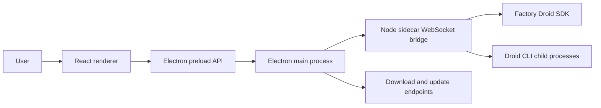

# Architecture

Droid Control is split into three runtime surfaces: the React renderer, the Electron host, and the Node sidecar.

## Runtime flow

## Components

| Area | Path | Responsibility |
| --- | --- | --- |
| Renderer | `src/` | React UI, local state, settings, onboarding, mission and session views |
| Electron main | `electron/main.cjs` | Window lifecycle, bridge process management, native browser lifecycle, downloads, update checks |
| Electron preload | `electron/preload.cjs` | Narrow API boundary between renderer and Electron main process |
| Native browser preload | `electron/nativeBrowserPreload.cjs` | Browser automation bridge for embedded native browser flows |
| Sidecar | `sidecar/src/` | Local WebSocket bridge, Droid SDK orchestration, mission management, CLI discovery |

## Data and control boundaries

- The renderer does not call the Droid SDK directly. It communicates through preload APIs and the sidecar bridge.
- The Electron main process owns local process lifecycle and injects bridge configuration into the sidecar.
- The sidecar owns Droid SDK calls and child process environment shaping. It removes `FACTORY_API_KEY` unless a key is explicitly configured.
- Packaged builds require a bridge token. Development builds may allow local no-token access with `BRIDGE_ALLOW_LOCAL_NO_TOKEN=1`.

## Build path

`npm run build` runs frontend typecheck and Vite build, builds the sidecar bundle, and syntax-checks Electron CommonJS entrypoints. The sidecar build emits `sidecar/dist/sidecar.mjs`, which Electron uses unless `SIDECAR_ENTRY` is set.

## Update path

Electron checks update metadata through `DROID_UPDATE_FEED` when configured. CLI downloads default to `DROID_DOWNLOAD_BASE=https://droidex.app`, with optional host allow-listing through `DROID_UPDATE_HOSTS`.
