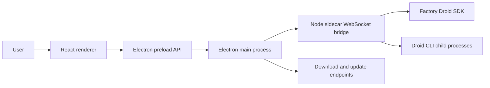

# Architecture

Droid Control is split into three runtime surfaces: the React renderer, the Electron host, and the Node sidecar.

## Runtime flow

```mermaid
flowchart LR
  User[User] --> Renderer[React renderer]
  Renderer --> Preload[Electron preload API]
  Preload --> Main[Electron main process]
  Main --> Sidecar[Node sidecar WebSocket bridge]
  Sidecar --> DroidSDK[Factory Droid SDK]
  Sidecar --> DroidCLI[Droid CLI child processes]
  Main --> Updater[Download and update endpoints]
```

## Components

| Area | Path | Responsibility |
| --- | --- | --- |
| Renderer | `src/` | React UI, local state, settings, onboarding, session and Mission Control views |
| Electron main | `electron/main.cjs` | Window lifecycle, bridge process management, native browser lifecycle, downloads, update checks |
| Electron preload | `electron/preload.cjs` | Narrow API boundary between renderer and Electron main process |
| Native browser preload | `electron/nativeBrowserPreload.cjs` | Browser automation bridge for embedded native browser flows |
| Sidecar | `sidecar/src/` | Local WebSocket bridge, Droid SDK session lifecycle, Mission Control integration, CLI discovery |

## Data and control boundaries

- The renderer does not call the Droid SDK directly. It communicates through preload APIs and the sidecar bridge.
- The Electron main process owns local process lifecycle and injects bridge configuration into the sidecar.
- The sidecar owns Droid SDK calls and child process environment shaping. It removes `FACTORY_API_KEY` unless a key is explicitly configured.
- Packaged builds require a bridge token. Development builds may allow local no-token access with `BRIDGE_ALLOW_LOCAL_NO_TOKEN=1`.

### Sidecar session core

- `SessionManager` is the composition root and public command coordinator. It retains compaction and browser policy plus Mission Control, child-session, token, and context non-transcript side effects and child run-state projection.
- `FactoryRuntime` is the narrow SDK seam; `DroidRuntime` is its production adapter.
- `SessionRegistry` owns the single live-session map, stable application identity, provider aliases, canonical summary persistence, and projected summary reads. Summary precedence is live, then Mission Control history, then ordinary history.
- `SessionTimeline` owns history listing and restore, legacy provider pages, child replay, status entries, and the canonical record-before-emit path for live transcript events.
- `SessionInteractions` owns permission and question correlation, equivalent-signature grants, and the Spec-to-Auto transition. After successful Registry unregister, Lifecycle calls `forgetSession()`, which discards module-owned state without resolving callbacks or emitting events. PR 4 introduces no deterministic shutdown settlement; that behavior remains deferred.
- `SessionEventFlow` owns stream and notification normalization, per-app/per-source terminal gating, and transcript-before-side-effect ordering. It has one callback into Manager for the coupled policy that remains there.
- `SessionLifecycle` owns create, resume, lazy resume, send queueing, steering, interruption, and ordered session cleanup. After successful Registry unregister, it tells the interaction and event-flow modules to forget that session's state.

## Build path

`npm run build` runs frontend typecheck and Vite build, builds the sidecar bundle, and syntax-checks Electron CommonJS entrypoints. The sidecar build emits `sidecar/dist/sidecar.mjs`, which Electron uses unless `SIDECAR_ENTRY` is set.

## Update path

Electron checks update metadata through `DROID_UPDATE_FEED` when configured. CLI downloads default to `DROID_DOWNLOAD_BASE=https://droidex.app`, with optional host allow-listing through `DROID_UPDATE_HOSTS`.
