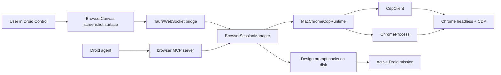

# Browser MCP Design Mode Implementation Plan

> For agentic workers: REQUIRED SUB-SKILL: use `superpowers:executing-plans` or `superpowers:subagent-driven-development` to implement this plan task by task. Keep checklist status current as work lands.

## Goal

Build a lightweight macOS-only browser canvas inside Droid Control that both the user and Droid agents can operate, plus a Design Mode for precise UI-change prompts.

This is not a Webflow/Figma editor. It is an agent editing surface:

- The user opens a live page in Droid Control.
- The user or agent can navigate, click, type, scroll, capture screenshots, and inspect visible DOM context.
- Design Mode lets the user select elements, sketch regions on a frozen screenshot, write a comment, and send a compact reference pack to the active Droid session.
- Droid agents receive browser MCP tools over the same live browser session, so they can inspect and operate the page natively.

## Core Decision

Use a first-party macOS Chrome/CDP runtime in the Droid sidecar. Do not depend on `agent-browser` for the product path.

Reason:

- Codex Browser works as a constrained browser-session service: tabs, viewport control, screenshots, coordinate input, DOM node references, and read-only selector helpers on top of browser automation.
- Droid needs the same shape, but inside Droid Control with shared user/agent state and Droid MCP wiring.
- The `agent-browser` skill/runtime may be useful as a reference or benchmark, but it is not currently exposed as a Droid tool and should not be a required dependency.
- A direct CDP runtime keeps the app lightweight: use the existing `ws` dependency, Node built-ins, and a small explicit MCP server. No Playwright or Puppeteer downloads.

Canonical engine:

- Google Chrome for macOS at `/Applications/Google Chrome.app/Contents/MacOS/Google Chrome`.
- CDP over a random local port bound to `127.0.0.1`.
- Dedicated profile directory under `~/Library/Application Support/Droid Control/browser-profiles/<sessionId>`.
- Default presentation mode is `fit`: the app chooses a clean preview size from the available canvas area while preserving the active browser viewport ratio.
- The browser viewport is explicit state, independent from how large the screenshot is rendered on screen.
- Headless Chrome for the first build so the browser is truly in-app through the Droid canvas.

Fail fast if Chrome is missing or CDP cannot start. Do not add WebKit, Safari, Puppeteer, Playwright, `agent-browser`, or cross-platform fallbacks in the first build.

## Codex Browser Plugin Findings

The bundled Codex Browser plugin is the right mental model:

- It exposes browser-level capabilities such as visibility and viewport.
- It models tabs and selected tab state.
- It captures screenshots through CDP layout metrics and `Page.captureScreenshot`.
- It offers coordinate computer-use actions and DOM-based visible element refs.
- It includes selector helpers, but those are wrappers around a controlled browser session.
- It keeps raw CDP constrained instead of giving agents unlimited browser internals.

Droid should adopt the same durable contract shape, not depend on the implementation package:

- A browser session service in the sidecar.
- A screenshot-backed React canvas.
- A small set of agent-safe MCP tools.
- A Design Mode reference pack layered above screenshots and DOM inspection.

## Factory Skill Direction

The Factory `droid-control` plugin is useful as agent workflow guidance, not as Droid Control's runtime boundary.

What it teaches:

- Keep driver surfaces scoped instead of building one global automation surface.
- Refresh snapshots after page changes because refs become stale.
- Capture visual evidence, not only text.
- Keep session names and output paths isolated.
- Route agent attention through small purpose-specific surfaces.

What not to do for this product feature:

- Do not require `npx skills add ...` as part of the app runtime.
- Do not install `.agents/skills` into this repo.
- Do not depend on `agent-browser install`, its downloaded Chromium, or its daemon.
- Do not hide the browser behind a CLI that the UI has to scrape.

The sustainable path is to encode the useful rules in Droid Control's own sidecar modules and tests.

## Product Shape

The Browser workspace should include:

- URL bar, reload, back, forward, viewport indicator, screenshot refresh.
- Screenshot canvas that scales responsively without layout shift.
- Viewport controls: Fit, Desktop, Laptop, Tablet, Mobile, and Custom.
- Clean viewport preview framing: show actual viewport dimensions, rendered scale, and enough surrounding space that narrow/mobile previews do not feel broken.
- Separate user and agent cursor overlays.
- User interactions: click, type, keypress, scroll.
- Agent interactions through MCP tools.
- Design Mode toggle.
- Element hover/selection outlines.
- Multi-select with numbered chips.
- Sketch mode with circles/boxes/freehand strokes on a frozen screenshot.
- Prompt bar that sends selected/sketched references to the active Droid session.

Out of scope for the first build:

- Full drag-and-drop visual editing.
- Voice input.
- Persisted visual layout edits.
- General browser extension support.
- Browser history sync for old local app states.
- Cross-platform support.
- Real-time video streaming. Refresh screenshots after actions first.

## Current-State Constraints

- `/Users/anas/Documents/droid-control` is the original checkout. The user has active frontend edits there. Do not touch it.
- `/Users/anas/Documents/droid-control-browser-mcp` is the feature worktree.
- Branch: `feature/browser-mcp-design-mode`.
- Repo: `anasibnanwar1-droid/droid-maxxing`.
- Baseline `main` has already been pushed.
- The implementation must use one canonical current-state path. No compatibility shims for historical local states.

## Architecture



Core pieces:

- `ChromeProcess`: resolve Chrome, allocate a local port, launch, and stop the process.
- `CdpClient`: own websocket transport, request ids, timeouts, and typed CDP calls.
- `MacChromeCdpRuntime`: compose process and CDP helpers into browser actions.
- `domSnapshot`: extract compact visible refs and point inspection data.
- `BrowserSessionManager`: own per-mission browser sessions, latest state, coordinate scaling, selected references, and prompt packs.
- `browserMcpServer`: expose safe browser tools to Droid sessions over stdio MCP.
- React Browser workspace: render screenshots, forward user events, show overlays, and package Design Mode prompts.

## Maintainability Rules

- Build a reusable smooth canvas primitive first. Browser screenshots, Design Mode overlays, and future canvas-backed surfaces should all use the same viewport math and overlay coordinate system.
- No browser mega-file. Split process launch, CDP transport, DOM extraction, runtime actions, session state, prompt packing, MCP, and React UI into separate modules.
- Keep module APIs small and explicit. Prefer plain typed functions/classes over broad abstractions.
- Keep CDP method names and payloads close to the runtime layer. React components should never know CDP details.
- Keep browser state serializable at the bridge boundary.
- Store screenshots and prompt packs as files. Do not put base64 blobs into bridge events or chat messages.
- Add tests at the lowest useful layer before wiring UI.
- Use small commits that each build toward the feature and can be reviewed independently.

## Target Files

Create:

- `sidecar/src/browser/browserPaths.ts`
- `sidecar/src/browser/browserPaths.test.ts`
- `sidecar/src/browser/ChromeProcess.ts`
- `sidecar/src/browser/ChromeProcess.test.ts`
- `sidecar/src/browser/CdpClient.ts`
- `sidecar/src/browser/CdpClient.test.ts`
- `sidecar/src/browser/domSnapshot.ts`
- `sidecar/src/browser/domSnapshot.test.ts`
- `sidecar/src/browser/MacChromeCdpRuntime.ts`
- `sidecar/src/browser/MacChromeCdpRuntime.test.ts`
- `sidecar/src/browser/BrowserSessionManager.ts`
- `sidecar/src/browser/BrowserSessionManager.test.ts`
- `sidecar/src/browser/designPromptPacks.ts`
- `sidecar/src/browser/designPromptPacks.test.ts`
- `sidecar/src/browser/browserMcpServer.ts`
- `src/components/browser/BrowserWorkspace.tsx`
- `src/components/browser/BrowserCanvas.tsx`
- `src/components/browser/DesignModeOverlay.tsx`
- `src/components/browser/DesignPromptBar.tsx`
- `src/components/canvas/SmoothCanvas.tsx`
- `src/components/canvas/canvasMath.ts`
- `src/components/canvas/canvasMath.test.ts`

Modify:

- `sidecar/package.json`
- `sidecar/src/DroidRuntime.ts`
- `sidecar/src/MissionManager.ts`
- `sidecar/src/protocol.ts`
- `src/types/bridge.ts`
- `src/lib/commands.ts`
- `src/lib/bridge.ts`
- `src/hooks/useStore.tsx`
- `src/App.tsx`

## Data Contracts

```ts
export interface BrowserViewport {
  width: number;
  height: number;
  deviceScaleFactor: number;
}

export type BrowserViewportMode = 'fit' | 'desktop' | 'laptop' | 'tablet' | 'mobile' | 'custom';

export interface BrowserViewportPreset {
  id: BrowserViewportMode;
  label: string;
  width?: number;
  height?: number;
}

export interface BrowserBox {
  x: number;
  y: number;
  width: number;
  height: number;
}

export interface BrowserElementRef {
  ref: string;
  selector: string;
  tagName: string;
  role?: string;
  name?: string;
  text?: string;
  attributes: Record<string, string>;
  className?: string;
  box: BrowserBox;
  computedStyles: Record<string, string>;
}

export interface BrowserState {
  sessionId: string;
  missionId?: string;
  url: string;
  title?: string;
  viewport: BrowserViewport;
  viewportMode: BrowserViewportMode;
  screenshotPath?: string;
  scroll: { x: number; y: number };
  refs: BrowserElementRef[];
  agentCursor?: { x: number; y: number };
  error?: string;
}

export interface DesignReference {
  id: string;
  kind: 'element' | 'region' | 'stroke';
  url: string;
  title?: string;
  viewport: BrowserViewport;
  screenshotPath: string;
  scroll: { x: number; y: number };
  element?: BrowserElementRef;
  box?: BrowserBox;
  points?: { x: number; y: number }[];
  note?: string;
}

export interface DesignPromptPack {
  missionId: string;
  browserSessionId: string;
  createdAt: string;
  instruction: string;
  references: DesignReference[];
}
```

## Agent-Facing MCP Tools

Expose these tools:

- `browser_open({ url })`
- `browser_snapshot({ interactiveOnly?: boolean })`
- `browser_screenshot({ fullPage?: boolean })`
- `browser_click({ ref?: string, x?: number, y?: number })`
- `browser_type({ text })`
- `browser_keypress({ key })`
- `browser_scroll({ direction, pixels? })`
- `browser_design_context({ referenceIds?: string[] })`

Behavior:

- All tools operate on the same session shown in Droid Control.
- Mutating tools refresh the screenshot and emit `browser.updated`.
- `browser_snapshot` returns compact visible refs, URL, title, and text snippets.
- `browser_screenshot` returns a local PNG path, never base64.
- `browser_design_context` returns JSON paths and screenshot paths for selected/sketched references.
- Invalid refs fail with clear errors.

## Browser Runtime Requirements

Runtime modules must split responsibility:

`browserPaths`:

- Resolve Chrome only at the canonical macOS path.
- Resolve profile, screenshot, and design-reference directories.
- Return explicit diagnostics when required paths are missing.

`ChromeProcess`:

- Allocate a free port on `127.0.0.1`.
- Launch Chrome with:
  - `--headless=new`
  - `--remote-debugging-address=127.0.0.1`
  - `--remote-debugging-port=<port>`
  - `--user-data-dir=<profileDir>`
  - `--no-first-run`
  - `--no-default-browser-check`
  - `--window-size=<width>,<height>`
- Fetch `/json/version` readiness with a bounded timeout.
- Cleanly kill the Chrome process when the session ends.

`CdpClient`:

- Fetch `/json/version` to get the browser websocket URL.
- Send CDP messages through `ws` with request ids and typed responses.
- Reject response errors with method context.
- Time out stuck requests.

`MacChromeCdpRuntime`:

- Create or reuse one page target per session.
- Enable `Page`, `Runtime`, `DOM`, and `Accessibility` domains.
- Navigate with `Page.navigate` and wait for load or a bounded timeout.
- Set viewport with `Emulation.setDeviceMetricsOverride`.
- Capture screenshots with `Page.getLayoutMetrics` and `Page.captureScreenshot`.
- Save screenshots under `~/Library/Application Support/Droid Control/browser-screenshots/<sessionId>/`.
- Click with `Input.dispatchMouseEvent`.
- Type with `Input.insertText`.
- Send keys with `Input.dispatchKeyEvent`.
- Scroll with `Input.dispatchMouseEvent` using `mouseWheel`.

## DOM Snapshot Requirements

Use `Runtime.evaluate` for a small visible-DOM snapshot:

- Walk visible, markable elements only: buttons, links, inputs, textareas, selects, contenteditable nodes, role-bearing nodes, and nodes with useful text.
- Limit the result count to keep MCP output compact.
- Generate stable-enough selectors from id, test id, aria label, name, tag, class, and nth-of-type.
- Include bounding boxes from `getBoundingClientRect`.
- Include role/name/text/attributes/class.
- Include a small computed style subset: color, background, font, border, border-radius, display, position, opacity, transform.
- Provide `document.elementFromPoint(x, y)` inspection for Design Mode clicks.
- React fiber/component/source info can be added later as best-effort metadata, but must not be required for MVP.

## Implementation Tasks

### Task 1: Worktree Guard

- [ ] Confirm `/Users/anas/Documents/droid-control-browser-mcp` is on `feature/browser-mcp-design-mode`.
- [ ] Confirm `/Users/anas/Documents/droid-control` only contains the user's existing frontend edits.
- [ ] Run all commits from the feature worktree only.

### Task 2: Sidecar Test Harness

- [ ] Add `sidecar` test script: `tsx --test src/**/*.test.ts`.
- [ ] Keep `npm run build` and `npm run typecheck` intact.
- [ ] Add unit tests before runtime implementation.

### Task 3: Browser Runtime Foundations

- [ ] Implement `browserPaths`.
- [ ] Implement `ChromeProcess`.
- [ ] Implement `CdpClient`.
- [ ] Unit test canonical path resolution and missing Chrome diagnostics.
- [ ] Unit test Chrome launch args and readiness timeout.
- [ ] Unit test CDP request id matching, response errors, timeout handling, and websocket cleanup with a fake transport.
- [ ] Run `cd /Users/anas/Documents/droid-control-browser-mcp/sidecar && npm run test`.

### Task 4: Reusable Canvas Primitive

- [ ] Implement `src/components/canvas/canvasMath.ts`.
- [ ] Implement `src/components/canvas/SmoothCanvas.tsx`.
- [ ] Unit test fit-to-container scale math, letterboxing offsets, and coordinate conversion.
- [ ] Keep the primitive independent of browser concepts: it accepts content size, overlays, pointer handlers, and children.

### Task 5: Browser Actions and DOM Snapshot

- [ ] Implement `domSnapshot`.
- [ ] Implement `MacChromeCdpRuntime` using `ChromeProcess`, `CdpClient`, `browserPaths`, and `domSnapshot`.
- [ ] Unit test screenshot path writing without exposing base64 to callers.
- [ ] Unit test click, type, keypress, and scroll payloads with a fake CDP client.
- [ ] Unit test DOM snapshot normalization and limits.

### Task 6: Browser Session Manager

- [ ] Implement session creation keyed by mission id.
- [ ] Implement viewport-to-canvas and canvas-to-viewport coordinate conversion.
- [ ] Implement viewport presets and `fit` mode without hardcoding one default desktop viewport.
- [ ] Implement open, refresh, snapshot, click, type, keypress, scroll, and close.
- [ ] Store latest browser state and emit compact bridge events.
- [ ] Implement `designPromptPacks`.
- [ ] Implement selected Design Mode references and prompt pack writing.
- [ ] Unit test coordinate conversion, ref lookup, prompt pack shape, and session cleanup.

### Task 7: Bridge Protocol

- [ ] Add browser commands to `sidecar/src/protocol.ts` and `src/types/bridge.ts`.
- [ ] Add browser events to both protocol files.
- [ ] Add typed helpers in `src/lib/commands.ts`.
- [ ] Wire bridge event handling in `src/lib/bridge.ts`.
- [ ] Run root `npm run build`.

Commands:

- `browser.open`
- `browser.refresh`
- `browser.resizeViewport`
- `browser.click`
- `browser.type`
- `browser.keypress`
- `browser.scroll`
- `browser.inspectPoint`
- `browser.design.addReference`
- `browser.design.sendPrompt`

Events:

- `browser.updated`
- `browser.error`
- `browser.agentCursor`

### Task 8: Droid MCP Server

- [ ] Add explicit `@modelcontextprotocol/sdk` dependency to `sidecar/package.json`.
- [ ] Implement `browserMcpServer.ts` with the agent-facing tools above.
- [ ] Use env vars for the session id and bridge endpoint.
- [ ] Return compact JSON/text only.
- [ ] Bundle `dist/browser-mcp.mjs` alongside `dist/sidecar.mjs`.
- [ ] Verify the MCP server starts and waits on stdio without crashing.

### Task 9: Droid Session Wiring

- [ ] Extend `DroidRuntime.createSession` options to accept browser MCP config.
- [ ] Pass `mcpServers` into the low-level Droid session creation path.
- [ ] Attach browser MCP only when Browser Mode is active for the mission.
- [ ] Fail fast if the browser sidecar session is not available.
- [ ] Do not retrofit old sessions. The user can start a new mission when browser tools are needed.

### Task 10: React Browser Workspace

- [ ] Add browser state and actions in `src/hooks/useStore.tsx`.
- [ ] Add Browser workspace mode in `src/App.tsx`.
- [ ] Build `BrowserWorkspace` with URL bar, navigation controls, viewport presets, scale indicator, Design Mode toggle, and prompt area.
- [ ] Build `BrowserCanvas` on top of `SmoothCanvas` as a screenshot image with stable aspect-ratio sizing and pointer forwarding.
- [ ] Add user cursor and agent cursor overlays.
- [ ] Ensure the UI works at desktop, tablet, and mobile presets plus narrow app windows.

### Task 11: Design Mode

- [ ] Build hover and selected element overlays from visible refs.
- [ ] Click selects `document.elementFromPoint` context.
- [ ] Shift-click multi-selects.
- [ ] Escape clears pending selection.
- [ ] Add sketch mode with frozen screenshot, box/circle/freehand strokes, and screenshot-relative coordinates.
- [ ] Add prompt bar validation: active mission, non-empty instruction, at least one reference.
- [ ] Send compact prompt pack paths to the active Droid chat.

Prompt format:

```text
Design Mode reference pack:
- URL: <url>
- Screenshot: <path>
- References JSON: <path>

User instruction:
<instruction>
```

### Task 12: Verification

- [ ] `cd /Users/anas/Documents/droid-control-browser-mcp/sidecar && npm run test`
- [ ] `cd /Users/anas/Documents/droid-control-browser-mcp/sidecar && npm run build`
- [ ] `cd /Users/anas/Documents/droid-control-browser-mcp && npm run build`
- [ ] Manual Browser smoke in Fit mode.
- [ ] Manual Browser smoke in Desktop, Tablet, and Mobile presets.
- [ ] Open a local app URL.
- [ ] Select one element in Design Mode.
- [ ] Sketch one region.
- [ ] Send "remove this dot pattern" to a Droid session.
- [ ] Confirm the Droid transcript includes reference pack paths.
- [ ] Confirm agent MCP can call `browser_snapshot`, `browser_click`, and `browser_screenshot`.

### Task 13: Commit and Push in Reviewable Slices

Use small commits:

- [ ] `browser: add sidecar test harness`
- [ ] `browser: add mac chrome process and cdp client`
- [ ] `canvas: add reusable smooth canvas primitives`
- [ ] `browser: add runtime actions and dom snapshots`
- [ ] `browser: add session manager and prompt packs`
- [ ] `browser: wire bridge protocol`
- [ ] `browser: expose droid mcp tools`
- [ ] `browser: add responsive browser workspace`
- [ ] `browser: add design mode references`

Each commit should build or have a clear reason why it is an intermediate test-only commit. Do not commit generated screenshots, profiles, `.agents/skills`, `node_modules`, or local runtime artifacts.

## Testing Strategy

Unit tests:

- CDP transport request/response matching.
- Runtime launch args and fail-fast diagnostics.
- Screenshot file writing.
- Coordinate conversion.
- DOM ref lookup.
- Prompt pack serialization.

Build checks:

- Root TypeScript/Vite build.
- Sidecar TypeScript build.
- MCP bundle build.

Manual checks:

- Wide viewport and narrow viewport.
- Coordinate clicks stay aligned after resize.
- Screenshot refresh after each mutating action.
- Selected refs remain aligned with the screenshot they belong to.
- Prompt bar text does not overflow.
- Agent cursor and user cursor are visually distinct.

## Caveats and Trade-Offs

- Screenshot canvas instead of embedded webview: this gives reliable screenshots, coordinate control, and cross-origin behavior for agents. It will not feel exactly like a native webview for text selection and browser chrome.
- Headless Chrome can behave differently from a user's normal browser. This is acceptable for MVP because the target is an agent-operable canvas, not a personal browsing session.
- Login state is isolated per Droid browser profile. Users may need to sign in inside the Droid browser session.
- React component/source metadata is best-effort. DOM refs, screenshots, boxes, styles, and text are the reliable core.
- CDP is powerful. Keep the MCP surface small and safe instead of exposing raw CDP to agents.
- Screenshot refresh is simpler than streaming. Add streaming only after the MVP proves interaction latency needs it.
- macOS only means faster delivery. Do not add Linux/Windows branches until the product behavior is proven.

## Ship Criteria

- The feature branch contains no edits to the user's original checkout.
- The sidecar can launch Chrome, navigate, screenshot, click, type, scroll, inspect, and close.
- Droid Control renders a responsive browser canvas.
- Droid sessions can receive browser MCP tools.
- Design Mode sends compact, file-backed reference packs.
- All listed tests/builds pass.

## Decision

Build Droid's browser control as a controlled browser session with a screenshot canvas, DOM refs, coordinate input, and safe MCP tools. Implement it directly with macOS Chrome/CDP in the sidecar. Keep `agent-browser` out of the canonical path.
